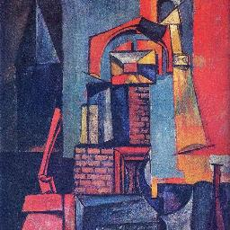

# cc-project

### Installation for Ubuntu
* ```curl -s https://packagecloud.io/install/repositories/github/git-lfs/script.deb.sh | sudo bash```
* ```sudo apt-get install git-lfs```
* ```git clone git@github.com:thalvari/cc-project.git```
* ```cd cc-project```
* ```python3 -m venv venv```
* ```source venv/bin/activate```
* ```python -m pip install -U pip setuptools```
* ```pip install -r requirements.txt```

### Example 1
Original content and style:




Markovified styles:


Artifacts:


### Example 2
Original content and style:


Markovified styles:


Artifacts:


